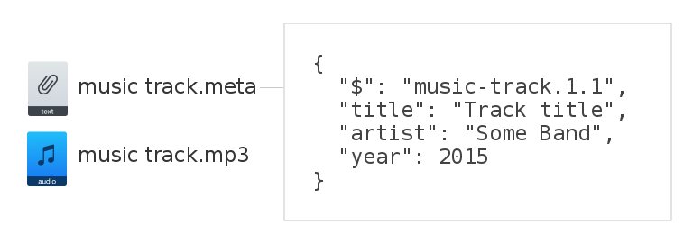
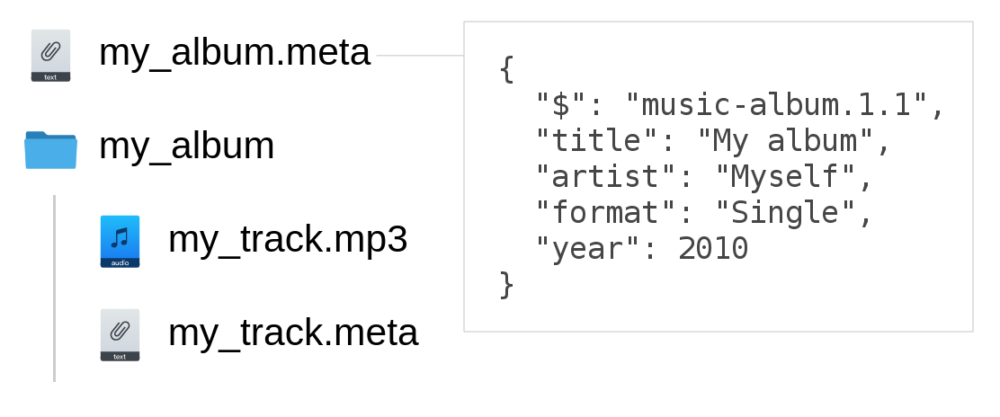

# Metabin Share

File sharing as simple as possible.

## Table of Contents

- [Roadmap](#roadmap)
- [Core ideas](#core-ideas)
- [License](#license)

## Roadmap

- [ ] sharing libs
  - [ ] js
- [ ] command-line app
  - [ ] Node.js
- [ ] gui app

## Core ideas

- **Filesystem as API**

To publish a file all you need is your file manager and text editor. Just create a `.meta` file with the same name and that's it!

- **Combined publications**

Single publications can be easilly combined in a higher-level publications. For example, separately published audio-files can be also published together as an album at the same time.

- **Metadata included**

Aside of pointing to the published files, .meta files also store all related metadata including connections with other entities. Describe it with a appropriate schema so modern distributed apps will be able to understand your content.

## License

MIT
